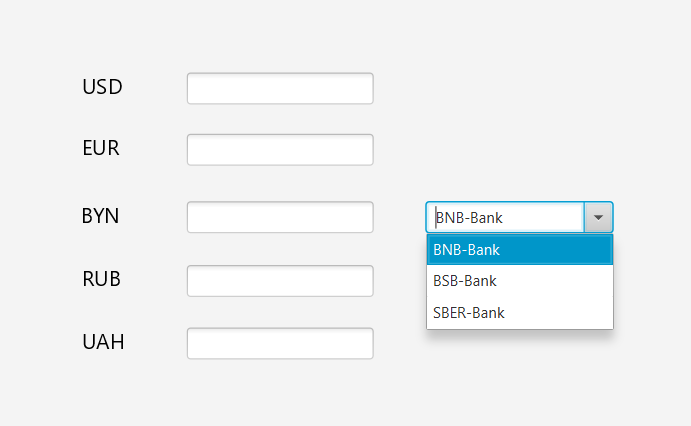
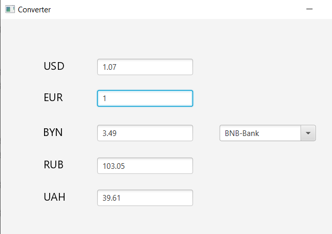
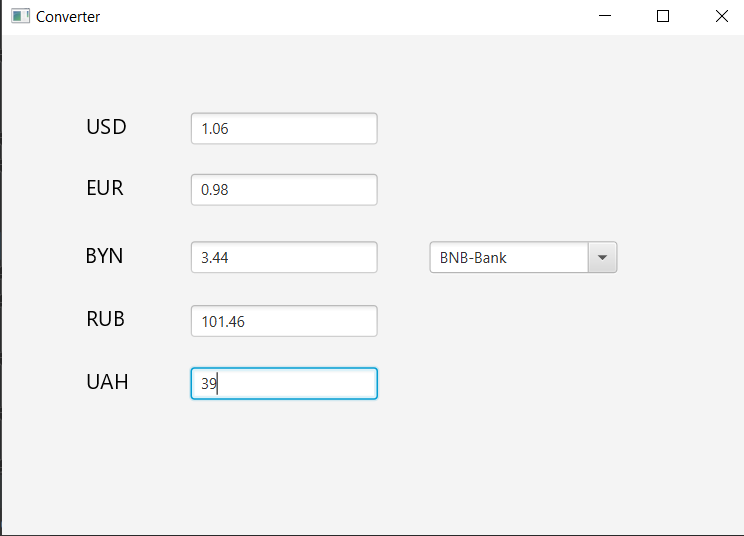
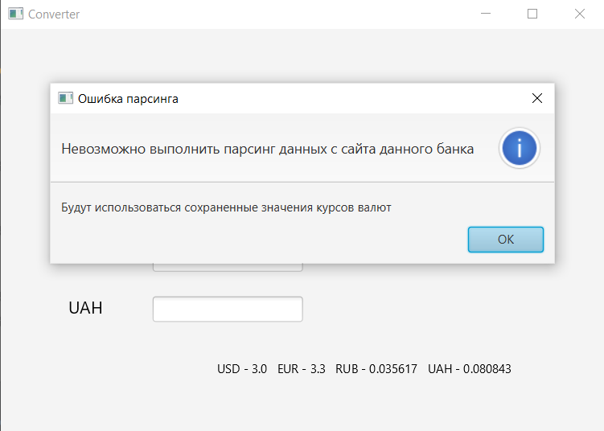

# money_converter
 simple money converter which can get currency rates by parser

 Still under development.

 Already implemented:
 1) Use of saved exchange rates in case of inability to connect to the site
 2) Parsing the exchange rate from the 2 banks
 3) Automatic conversion of currencies in other fields, when changing the value in one of the fields

 It is planned to add:
 1) Saving the last successfully loaded exchange rates
 2) Debugging and exception tracking
 
<h1>Screenshots of work</h1>
<h3>Screenshot of choosing bank</h3>

<h3>Screenshot of automatic calculation of values in other fields after each change of any of the fields</h3>

<h3>Screenshot of errors when connecting to the site</h3>

